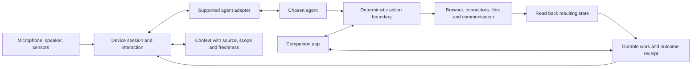

# Adam: company and product review

8 September 2026 · Evidence-backed recommendations, not a claim of product-market fit

## The company we are trying to build

**Adam is building consumer hardware that gives people’s preferred AI a useful physical presence in their home.** Voice is the main interface. Ambient sensing supplies context when it can do so reliably and appropriately. A general agent runtime turns intentions into verified digital outcomes. The companion app handles setup, private information, approvals, and history.

That is broader than a household-administration assistant, and more concrete than “an operating system for the physical world.” Household logistics, learning, making things, and play are applications. The common product is an AI that is available where life happens, knows enough about the situation to help, and can actually follow through.

The latest founder direction explicitly puts hardware at the centre. Earlier documents put more emphasis on software readiness and household responsibility. Preserve the reusable software work, but do not make completing every conceivable software capability a prerequisite for testing a physical product. Run room experience and runtime reliability work together.

My recommendation is to keep the ambition and narrow the first experiment. The first release must answer: **why would someone leave this switched on in their home when they already have a phone and an AI subscription?** “Uses different models” is helpful, but insufficient on its own.

## What the evidence establishes

| Area | Established in this review | Still unproven |
|---|---|---|
| Direction | Latest conversations describe open consumer AI hardware; previous archive supports general capabilities and ambient usefulness | First customer segment and the repeat-use behaviour that earns the physical device |
| Software | Node backend with a general reasoning loop, execution boundary, browser primitives, approvals, durable work, and an iOS app | Broad consumer task reliability in real homes |
| Agent interoperability | A separate ongoing task has local CLI and speech proof; its evidence file distinguishes individual provider/authentication boundaries | Reliable far-field spoken interaction across supported agents in a room; arbitrary closed-agent compatibility |
| Ambient context | Code represents presence and household facts | Wi-Fi sensing that reliably recognises useful situations across different homes |
| Operations | Live health and version endpoints responded; production reported commit a1775188f90a92af7ecc453337469e35b09e386a, built 3 September | That any particular household job works end to end; health is not an acceptance test |
| Traction | Relevant prior outreach and some two-way conversations exist | Current active users, paying users, household retention, budget, runway, team commitments, and manufacturing economics |

Do not reuse old email claims about planned unit volumes, future revenue, or previous product versions as current traction. Those were proposals. The YC story should distinguish a running prototype from a household pilot and a pilot from paid retention.

## A product people could want

Start with technically comfortable people who already use an AI frequently, share a home, and can tolerate an early prototype. This is a recruitment hypothesis, not an established market. Recruit several households outside the founder’s close friends so politeness does not masquerade as demand.

The first experience should combine three behaviours:

1. **Speak and continue.** Ask the supported agent something while cooking or working. Interrupt it naturally. It stops speaking promptly, keeps the conversation coherent, and resumes from what was actually heard. The phone is not the normal remote control.
2. **Hand over something real.** Ask for an outcome that uses connected digital capabilities. Adam reports an actual result, asks a necessary question, or returns with a clear failure. It never turns tool invocation into a fictional completion.
3. **One earned interruption.** With permission, Adam notices one specific, experimentally verified situation and says something useful at an appropriate time. Start with a narrow signal whose accuracy can be measured. Keep a delightful spoken interaction, such as a game, in the pilot as well: utility alone may not make a device welcome.

These are acceptance behaviours, not three domain agents. They should use the same capabilities, authority boundary, and persistent state.

Prototype on commodity mains-powered hardware with a microphone and speaker. Measure acoustics before commissioning a custom board or enclosure. Far-field audio, echo cancellation, interruption, reconnection, and daily startup reliability are central product features. A beautiful render cannot compensate for having to repeat yourself.

Treat Wi-Fi CSI as an investigation, not a promised semantic sensor. Espressif’s reference material supports experimentation with wireless sensing; it does not establish that Adam can identify a particular person, know the washing machine has finished, or distinguish a pet from a child in an arbitrary home. Pick one phenomenon, establish ground truth, test empty-room and ordinary-motion confounders, and compare alternative sensing approaches. [Espressif ESP-CSI](https://github.com/espressif/esp-csi)

Physical privacy should be understandable: an unmistakable microphone mute control, a clear indication of listening or processing, guest behaviour, and a way to remove household data. Camera-free sensing still needs a comprehensible explanation of what is inferred and retained. Default experimental telemetry to event timings and user corrections rather than raw household recordings.

## Competition and the reason to exist

Amazon is already extending Alexa with generative conversation and actions. Google has Gemini for Home and a dedicated speaker direction. Competing on “a speaker you can talk to naturally” means entering their core territory. [Amazon Alexa+](https://www.aboutamazon.com/news/devices/new-alexa-generative-artificial-intelligence), [Google Gemini for Home](https://blog.google/products-and-platforms/devices/google-nest/gemini-for-home-launch/)

Home Assistant already offers voice hardware with local and cloud options. Openness and privacy are therefore not uncontested territory either. [Home Assistant Voice Preview Edition](https://www.home-assistant.io/voice-pe/)

Adam’s proposed advantage is the combination of a consumer-quality room experience, continuity with a supported preferred agent, useful physical context, and dependable follow-through. Each part must be demonstrated. Do not claim a moat merely because these words appear together in a pitch.

Potential defensibility comes later from unusually good acoustic and interaction engineering, a compatible device and agent protocol, trusted context handling, distribution, and the accumulated ability to recover from real household failures. A corpus of consented, privacy-preserving failure cases can improve the product; collecting intimate raw data is not a business strategy.

The sequence should be one desirable product, then repeatable installation and support, then broader agent and device compatibility. An ecosystem without users creates integration work without distribution.

## Architecture: deepen the existing system

The best architectural decision already present is separating probabilistic reasoning from deterministic permission. Preserve it. The agent orchestrator, action execution boundary, contracts, browser environment, and transaction authorisation are useful foundations. Do not replace them with shopping, travel, or household-specific loops.

This is a proposed responsibility map, not a diagram of fully implemented compatibility. External agents may possess their own tools; Adam must clearly define which actions it mediates and must not imply that its permissions automatically constrain an arbitrary external process.

| Priority | Change | Why it matters | Acceptance proof |
|---|---|---|---|
| Now | Define a supported-agent event contract: text, status, input request, tool event, final, error, cancellation | Stops each provider from creating a separate device product | Same interaction suite passes for each advertised adapter; unsupported events fail explicitly |
| Now | Track generated, queued, spoken, and interrupted output separately | Users should not be treated as having heard words that were never delivered | Interrupt midway; next answer reflects the delivered portion and preserves the underlying agent identity |
| Now | Carry unavailable/unknown states through the app and context | False reassurance destroys confidence in ambient products | Expired session, failed source, stale location, disconnected device all render truthfully |
| Before shared-home pilot | Introduce household membership and subject-scoped authority | A list of known people is not a multi-user permissions model | Another member and a guest cannot hear private messages or approve someone else’s action |
| Before sensor claims | Context evidence envelope: source, observed time, expiry, subject, confidence meaning, correction/retraction | Inferences must not become permanent facts | Conflicting or expired observations become unknown; user correction changes subsequent behaviour |
| Next | Extract request composition from api/index.js behind stable module interfaces | Roughly 9,900 lines concentrate wiring, policy, and integration risk | Small extraction preserves route behaviour and passes existing acceptance cases |
| Next | Extract Home loading and derived state from AgenticHomeView | Roughly 2,100 lines mix requests, state, and presentation | One state model covers loading, partial, stale, empty, error, and populated cases |
| Next | Resolve Swift concurrency warnings by clarifying ownership and actor boundaries | Current build warns that several patterns become errors in Swift 6 mode | Clean build for the touched subsystem without blanket suppression |

Do these as small vertical changes with behaviour tests. File length alone is not a reason for a rewrite. The valuable boundary hides complexity and makes correctness easier to inspect.

Review action replay and resumption before real unattended use: duplicate delivery must not duplicate a consequential action; approval must remain bound to the exact actor, target, and current terms; verification failure must remain unresolved. These are test requirements, not a claim that this review discovered an exploitable bypass.

Keep the client contract bounded. It should expose a human-readable result and enough evidence to understand it, not connector responses, cookies, credentials, or raw browser state. Continue the live-schema check before deployment.

## Design and naming

**Keep Adam for this phase.** There is not enough evidence that another rename would improve adoption. Use one external name consistently across the app, pitch, demo, and outreach. Oxy can remain an internal repository name while changes would create churn. Naming clearance, domains, and trademarks were not established by this review.

Use “Adam — a home for your AI” as an exploratory line, followed by the literal description of what the prototype supports. Avoid “any AI” until compatibility is documented. “Open” should mean the specific choice and interoperability you actually provide; it need not imply open-source licensing or access to private memory inside closed products.

The strongest visual direction is quiet, tactile, and domestic. Keep one clear type hierarchy, restrained surfaces, actual bundled icons, and a single brand moment. Repeated logos and a busy card dashboard make a physical product feel like an admin console. Preserve the current visual system long enough to test use, instead of changing palettes every session.

The companion app needs to answer: Is my device connected? What needs me? What happened? What can it access? A successful empty state is distinct from missing data. The review reproduced the app showing reassuring copy alongside an expired session; the local patch now removes that contradiction.

Navigation is worth testing: “Adam” and “Home” are adjacent concepts that may be difficult to distinguish. Do not rename them speculatively today. Ask pilot users where they would find a pending approval, a household member, and yesterday’s completed job. Consolidate or relabel from that evidence.

For hardware styling, test placement, audible reach, mute discoverability, and whether people accept the object in a shared room before refining luxury materials. A consistent light or sound vocabulary should distinguish listening, thinking, speaking, muted, disconnected, and needs-permission without requiring users to memorise decorative animations.

## A pilot that produces a company decision

Proposed sequence: two supervised homes first; expand toward ten only when setup, permissions, and the core spoken loop survive ordinary use. Run four weeks once those homes are installed. These are proposed targets, not existing users or a guarantee that ten households establishes product-market fit.

Record the denominator. A high success rate means little if only easy tasks reach the metric.

| Measure | What to record |
|---|---|
| Spoken reliability | Attempted sessions, successful completion, repeats, phone rescue, median and p95 first-audio latency |
| Follow-through | All accepted outcomes, verified completions, unresolved failures, founder interventions, elapsed time |
| Interruptions | Number delivered, household usefulness rating, false alarms, mute/disable events |
| Repeat use | Active households per week, unprompted sessions, what people return for, week-four retention |
| Hardware burden | Install minutes, reconnects, crashes, audio failures, support minutes per home |
| Demand | Want-to-keep interview, willingness to pay at a stated price, actual paid commitment when a sellable offer exists |
| Economics | Hardware and fulfilment estimate, inference cost per active home, support cost, expected warranty burden |

Suggested decision thresholds to agree before the pilot: at least six of ten households still voluntarily using it in week four; most retained households can name a recurring behaviour they would miss; at least 90% of the narrowly supported spoken sessions succeed without phone rescue; and every sensitive action in the acceptance corpus follows the approval boundary. These are management gates, not industry benchmarks. Examine individual failures even when the aggregate passes.

If people enjoy talking but delegate nothing, the product may be entertainment or companionship. If it works only when the founder helps, installation and recovery need work. If sensing adds noise, remove that feature from the first release. If the phone is consistently easier, improve the room interaction before expanding the catalogue of actions.

## Building a large business

A billion-dollar outcome requires a repeatable business, not a particular pitch valuation. There are several possible paths: a profitable consumer device with ongoing services people choose to buy, a family of compatible devices, or eventually a platform licensed into other manufacturers’ products. Pick the first revenue engine before treating the others as forecasts.

Do not assume hardware margin will pay for unlimited cloud inference and lifetime support. For each price hypothesis calculate: net device revenue minus landed hardware, fulfilment, payment fees, returns, warranty reserve, and support. Calculate recurring service contribution separately after inference and ongoing support. Model low, typical, and heavy usage. A preference for no mandatory software subscription is compatible with using a supported customer-provided agent account or an optional paid service; provider access and commercial terms still need verification.

Illustration only: 100,000 devices at £250 is £25 million of gross device revenue before costs, taxes, and returns. One million is £250 million. Neither number implies a valuation or achievable demand. This is why distribution, returns, retention, and cost discipline matter as much as the demo.

Start distribution with founder-led installations and short, unedited demonstrations of real behaviour. Turn satisfied pilot households into referrals. Publish a specific compatibility promise and the limitations. Do not spend heavily on paid acquisition, inventory, a developer ecosystem, or elaborate launch content before there is a behaviour people seek out repeatedly.

The highest-leverage complementary hire is someone who can own embedded systems, audio, and hardware delivery. A bounded paid architecture review is useful sooner than a vague advisor title. A potential cofounder should first work with you on a concrete prototype milestone and discuss commitment, ownership, and decision-making. Do not set equity from a generic percentage in an earlier chat. YC argues for meaningful ownership for genuine cofounders; the actual arrangement depends on the relationship and formal advice. [YC on founder equity](https://www.ycombinator.com/blog/splitting-equity-among-founders)

## YC, funding, and the next month

The official YC page currently lists the Winter 2027 batch, January–March in San Francisco, with an on-time deadline of 2 November at 8 p.m. Pacific. Your earlier conversation selected 18 September as an internal submission target. Keep that as the draft/submission milestone if feasible; it is not the official deadline, and it is not necessary to invent traction to hit it. [YC application page](https://www.ycombinator.com/apply)

The application should make five things easy to understand: the physical product, who initially wants it, why existing devices are insufficient, what actually runs today, and what you learned from people using it. A short genuine demo and fast measured progress are more persuasive than promising a twenty-billion-dollar exit.

Seedcamp’s current FAQ describes investing as early as pre-product and typical first cheques of US$350,000–US$1.25 million. Its stated process timing follows meeting the team; it is not a guaranteed response time after a form submission. Treat this as a plausible funding route, not an entitlement or substitute for customer evidence. [Seedcamp FAQ](https://seedcamp.com/faqs/)

The a16z speedrun alpha page has specific US full-time work-authorisation and software-engineer eligibility requirements. Check actual fit before spending time on that application. Do not carry a previously suggested deadline forward unless it appears in current official materials. [speedrun alpha](https://speedrun.a16z.com/alpha)

| Window | Concrete output |
|---|---|
| 8–10 September | Freeze the one-sentence company description; finish the supported-agent voice proof; record exact limitations; recruit initial pilot conversations |
| 11–14 September | Demonstrate an uninterrupted and interrupted spoken session on commodity hardware; run permission and reconnect failures; conduct the first household interviews |
| 15–18 September | Prepare the YC application with actual team, prototype, and usage facts; record a short truthful demo; follow up the strongest hardware contacts |
| Following two weeks | Supervised installs in two homes; measure repeated use and support burden; expand only after the critical experience works |
| Following 30–90 days | Complete a measured pilot; decide what behaviour earns the device, which sensor helps, and whether to fund a custom hardware iteration |

Current budget, weekly availability, team commitments, and existing traction remain unanswered inputs. The schedule is a proposed sequence with dependencies, not a resource-backed promise. No application has been submitted and no outreach has been sent by this review.

## Work implemented in this review

- Home now distinguishes failed or incomplete source reads from a successful empty board. The backend returns bounded source-availability metadata and retains independently available work. Supabase errors from the relevant reads are explicitly handled.
- The iOS Home suppresses ready/no-action reassurance when data is unavailable or still loading, reports a disconnected device plainly, surfaces previously swallowed fetch failures, and removes redundant branding from the top device control.
- Presence parsing rejects blank, boolean, non-finite, and out-of-range coordinates. Valid zero coordinates and numeric aliases remain supported.
- The obsolete browser-ordering test for a removed private task loop was preserved byte-for-byte under test/retired with its checksum and rationale, rather than left breaking the active suite.

Validation on 8 September: npm test reported **1,850 tests, 1,848 passed, 0 failed, 2 skipped**. The undefined-reference check reported **0 errors, 1 existing warning**. The rebuilt iOS app ran in the simulator; the expired-session state displayed “Updates unavailable” and “No device connected,” without the previous reassuring empty-state copy. The latest incremental build reported seven warnings and no errors; the earlier fuller build exposed additional existing concurrency/deprecation warnings. Warning count varies with what recompiles.

The new database-availability cases use injected database responses; they prove local failure propagation, not a live production outage recovery. The simulator check proves the expired-session screen, not live household capability. No changes from this review were committed, pushed, or deployed. Concurrent Mac runtime and other existing edits were preserved.

## Source coverage and handoff

This review used the recovered pre-refactor archive, repository and shared-memory context, current code, simulator observation, production health/version reads, targeted Gmail searches, and official external sources. It inspected the recent task inventory and directly read these relevant conversations: Company description summary; a16z Video Requirement; YC application timing; Execute Adam Progression Plan; Apple hardware origins; Build Adam app UI design; Review brief and note issues; Run Adam CLI interoperability proof. The long progression response was only partially retrievable through the task reader. This is substantial source coverage, not a claim to have read every historical conversation or every message in the inbox.

The private contact evidence and suggested unsent messages live separately in the accompanying private network brief, outside this repository. No personal email content is needed to explain the product architecture.

Next engineering slice: finish and measure the existing agent-to-speaker interaction, including interruption and delivered-output accounting. Do not start another private agent loop or duplicate the concurrent Mac interoperability work. Next founder slice: two actual room-use trials and the highest-confidence hardware conversations. Review PRODUCT.md and DESIGN.md against the latest hardware-first direction as a deliberate follow-up; both already contain concurrent edits, so this review did not overwrite them.
